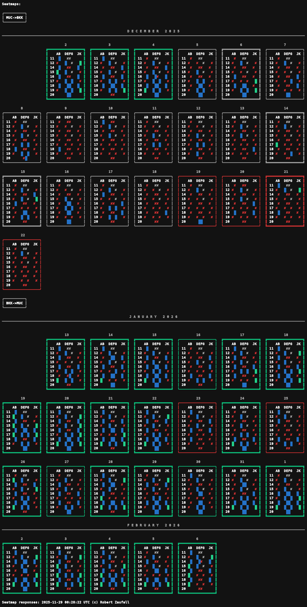

# Business Class Seatmap Generator w/ Amadeus API

CLI utility for browsing Amadeus seat-map availability across a set of long-haul trips. It pulls live data from the Amadeus Self-Service APIs and caches each day's responses under `data/<YYYYMMDD>` so you can re-render the output without hitting the API again.

## Example output


_Figure: Example terminal output showing the weekly ASCII seat maps (Mon–Sun)._


_Figure: Example terminal output showing the date-sorted ledger of available window seats including calendar heatmap for the price._


_Figure: Example terminal output showing the price heatmaps for all flight combinations - one for windows seats and one for all._


_Figure: Example terminal output showing the weekly ASCII seat maps (Mon–Sun) in an alternative layout._

## Highlights
- Builds ASCII seat maps with wide-character awareness so layouts stay aligned even when using emoji markers.
- Highlights the lowest fare per route with a green border so deals stand out immediately.
- Caches availability, pricing, and seatmap responses by run date (`data/<YYYYMMDD>`) for quick offline replays.
- Prints a week-by-week grid plus per-day window-seat summaries with optional pricing pulled from flight offers.
- Generates calendar heatmaps (per route and round-trip) to make fare trends obvious when scanning many dates.

## Requirements
- Python 3.11+ (tested locally with 3.11)
- `pip install -r requirements.txt`
- Amadeus Self-Service API credentials (test and/or production)
- Pillow (for PNG export; included in `requirements.txt` so GitHub Actions can commit PNGs)

## Local setup
```bash
python -m venv .venv
source .venv/bin/activate
pip install --upgrade pip
pip install -r requirements.txt
cp .env.template .env
```

Fill in the `.env` file with the credentials from your Amadeus developer account:

```
TEST_AMADEUS_CLIENT_ID=...
TEST_AMADEUS_CLIENT_SECRET=...
AMADEUS_CLIENT_ID=...
AMADEUS_CLIENT_SECRET=...
```

The script reads these via `python-dotenv`, so the `.env` file only needs to exist in the repo root.

## Configuration
Most runtime knobs live in `config.py`, so you rarely need to edit `flight_search.py` directly. Notable settings:
- `ENVIRONMENT` picks the Amadeus host and must be either `production` or `test` for the fetch scripts.
- `TRAVEL_WINDOWS` lists the routes/date ranges that should be fetched and rendered.
- `FLIGHT_SEARCH_FILTERS` stores the request arguments (`travel_class`, `non_stop`, `included_airline_codes`, etc.) passed to the Amadeus `flight_offers_search` endpoint.
- Visual toggles such as `SEATMAP_OUTPUT_STYLE`, `SHOW_SEATMAP_PRICE`, `HEATMAP_EMPHASIS_STYLES`, `STATUS_SYMBOLS`, and `WINDOW_AVAILABLE_SYMBOL` control how the ASCII/emoji output looks.
- Currency/price decoration (`CURRENCY_SYMBOLS`, `BORDER_COLORS`, etc.) reference the semantic tokens defined in `colors.py`; extend `colors.TOKEN_MAP` if you need custom ANSI sequences.

## Travel windows & filters
Define the routes and date ranges you care about by editing the `TRAVEL_WINDOWS` list inside `config.py`. Each window is inclusive, so the scripts request seat maps for every day in the range. The first two windows drive the combined round-trip heatmaps (outbound vs. return).

Flight-offer search filters live in `config.FLIGHT_SEARCH_FILTERS`, so you can tweak cabin class, airline, or connection rules without touching the main script. Any key/value pairs in this dict get splatted into the `SeatMaps.fetch` call.

## Workflow
1. Configure `config.py` (set `ENVIRONMENT` to `test` or `production`, define `TRAVEL_WINDOWS`, adjust `FLIGHT_SEARCH_FILTERS`).
2. Load environment variables from `.env` (see above).
3. Fetch and cache data for **today's** run:
   ```bash
   python get_availability.py       # builds travel_dates.json + availability_responses.json
   python get_prices_return.py      # round-trip pricing -> pricing_responses*.json
   python get_prices_oneway.py      # per-leg pricing -> pricing_responses_*oneway*.json
   python get_seatmaps.py           # seat-map payloads -> seatmap_responses.json
   ```
   Each script reuses the existing files for today's date unless you flip `refresh_data = True` near the top of the file.
4. Render the reports from the cached data:
   ```bash
   python flight_search.py
   ```

### Data directory layout
All generated API responses are timestamped by run date: `data/<YYYYMMDD>/`. Common files include:
- `travel_dates.json`: cleaned list of dates per travel window (from availability checks).
- `availability_responses.json`/`unavailable_flights.json`: raw availability responses and filtered-out flights.
- `pricing_responses.json` and `pricing_responses_simple.json`: round-trip pricing used to build seatmap requests.
- `pricing_responses_oneway.json` and `pricing_responses_simple_oneway.json`: leg-level pricing used for labels and price lookups.
- `seatmap_responses.json`: raw seatmap payloads consumed by `flight_search.py`.

If you want to re-render a prior run, copy its dated folder to today's date inside `data/` so `flight_search.py` can find the JSON files.

## Output details
- **Weekly seat-map grid** – One block per day, grouped by week. Missing data shows a `NO DATA` placeholder, and the absolute lowest fare per route gets a green border plus a rounded price label at the bottom of the block.
- **Route availability boxes** – After the grid, every route receives a bordered box that lists the available window seats per date, prefixed with a relative fare symbol and paired with a mini calendar heatmap for additional visual context.
- **Round-trip price heatmaps** – If you provide at least two travel windows (outbound + inbound), the script prints two combined matrices: one based on window-seat fares only and another that considers any price returned by the offer search.

## Contributing
No special tooling is required beyond standard linting/formatting for Python scripts. Please keep fixtures anonymized and avoid committing sensitive traveler data.

## License
This project is released under the MIT License. See [LICENSE](LICENSE) for the full text.
